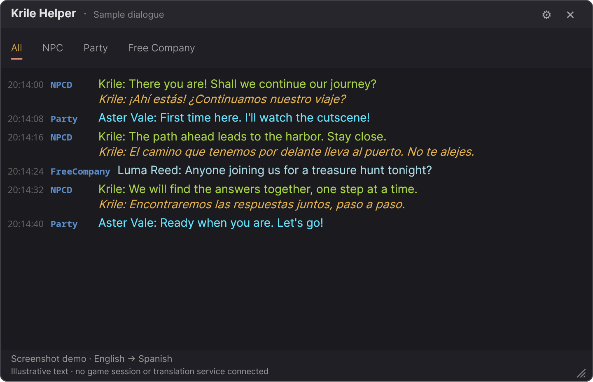
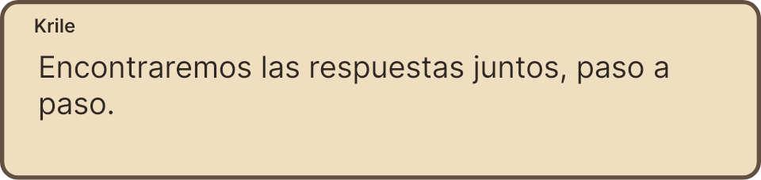
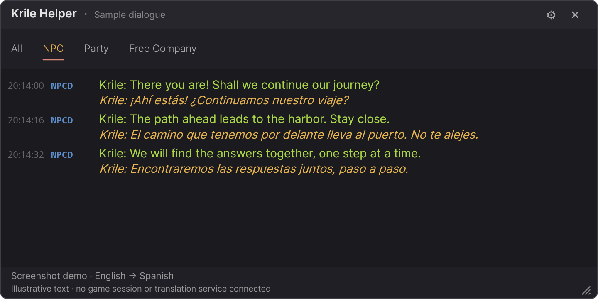
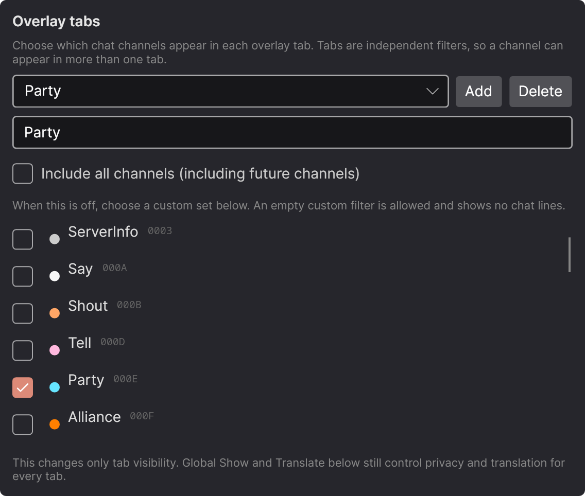

# Krile Helper — Linux

Current Linux release: **1.2.0**.

Native Linux port of [Tataru Helper](https://github.com/NightlyRevenger/TataruHelper),
renamed to **Krile Helper** for the Linux fork. A real-time chat translation
overlay for **Final Fantasy XIV** running under Proton/Wine. No Wine-side
injection, no DLL hooks: reads game memory directly from the host using
`process_vm_readv` plus the canonical Sharlayan signatures.

This Linux-exclusive fork keeps the native Avalonia UI, Linux memory reader,
tray integration, and packaging rather than running the Windows WPF application
under Wine. Translation engines, dialogue handling, and Russian reference
translations were adapted from upstream
[`v1.0.12`](https://github.com/NightlyRevenger/TataruHelper/tree/v1.0.12)
(`060155040c1c9e47c7d6f4bf0f5923a612d57b45`).
Credit for the original implementation, signatures, chat decoding, and artwork
belongs to upstream and its contributors, including NightlyRevenger, progneo,
and xDarkOne. Their MIT copyright notices are preserved in [LICENSE](LICENSE).

## See it in action

**Live dialogue translation, game-aligned overlays, and your own chat tabs.**
Keep the original text alongside its translation, follow the story without
waiting for the chat log, and separate NPC dialogue from party or Free Company
messages.

These screenshots show the actual Linux UI with illustrative English → Spanish
dialogue and fictional player names, not a connected FFXIV session or live
translation-service output. No game assets or private chat are included.

### Live translation

Original messages stay visible, with translations highlighted underneath.
Live reading picks up dialogue, cutscene subtitles, speech bubbles, and choices
without waiting for them to reach the chat log.



Party and Free Company messages are shown untranslated here: translating social
channels is an explicit opt-in, independent of which tab you are viewing.

### Translations over dialogue boxes

Prefer to keep your eyes on the scene? Enable **Settings → Live dialogue →
Place translations over the game's dialogue boxes** for click-through
translations positioned at the game's dialogue, subtitle, and choice bounds.



*The aligned dialogue window shown on its own, without a game background.*
Requires an accessible X11/XWayland game window; speech bubbles stay in the chat
overlay. See [live dialogue and aligned overlays](#live-dialogue-and-aligned-overlays)
for behavior and desktop limitations.

### Chat tabs that fit how you play

Create **NPC**, **Party**, **Free Company**, or your own channel combinations in
**Settings → Overlay tabs**. Switching from **All** to **NPC** filters the same
history without losing translations or retranslating shared messages.



<details>
<summary>See the tab editor</summary>

Choose a name and channels for each tab, or turn on **Include all channels**.
This example keeps only Party messages in the Party tab.



</details>

Tabs remember their scroll positions during the session; names, filters, and
the active tab save automatically. See [configurable chat tabs](#configurable-chat-tabs)
for setup and channel-privacy controls.

## Architecture

| Project | Target | Purpose |
|---|---|---|
| [`Sharlayan.Core`](Sharlayan.Core/) | net8.0 | Linux process discovery, PE/signature scanning, chat decoding, live Talk/subtitle/bubble/choice snapshots, player metadata, and duplicate suppression. |
| [`Translation.Core`](Translation.Core/) | net8.0 | Seventeen translation engines, bounded translation cache, FFXIV-aware AI prompts, and the optional SQLite Russian reference index. |
| [`KrileHelper.UI`](KrileHelper.UI/) | net8.0 (Avalonia 11) | Chat and game-aligned overlays, channel/provider settings, name protection, and game-owned font icons/world names read through Lumina. |
| [`MemoryProbe`](MemoryProbe/) | net8.0 | CLI diagnostic: attached process, signatures, player metadata, live dialogue state, and new chat lines. |

## Build & run from source

Requires .NET 8 SDK (`pacman -S dotnet-sdk-8.0` on Arch).

```sh
cd KrileHelper.UI
dotnet run -c Release
```

Diagnostic CLI:

```sh
dotnet run --project MemoryProbe -c Release
dotnet run --project MemoryProbe -c Release -- --once
```

`--once` prints one live snapshot and exits. The regular mode reports live state
changes and chat independently. An unavailable live layout does not disable chat.

Run tests:

```sh
dotnet test KrileHelper.sln -c Release
```

Native overlay lifecycle regression (requires an X11/XWayland desktop with a
running window manager):

```sh
dotnet run --project scripts/OverlaySmoke -c Release
```

This opens and closes its own diagnostic windows; FFXIV is not required. It checks
the compositor's actual always-on-top state, stacking order, click-through input
region, and non-activation across repeated hide/show cycles. Headless layout tests
cannot detect a window being mapped behind the game.

## Packaging — single-file binary

```sh
scripts/publish.sh                # produces dist/linux-x64/krile-helper
scripts/publish.sh linux-arm64    # for ARM
```

## Install for the current user

```sh
cd dist/linux-x64
./install.sh
```

Drops:

- `~/.local/bin/krile-helper`
- `~/.local/share/icons/hicolor/256x256/apps/krile-helper.png`
- `~/.local/share/applications/krile-helper.desktop`

After install, "Krile Helper" appears in your application menu, or run
`krile-helper` from a terminal (assuming `~/.local/bin` is on `$PATH`).

To uninstall: run `./uninstall.sh` from the dist directory. User configuration,
signature cache, and downloaded reference indexes are preserved.

## Runtime requirements

- A graphical desktop session. Aligned dialogue overlays need an accessible
  **X11/XWayland** game window, including on a Wayland desktop.
- Desktop libraries: fontconfig, libxkbcommon, libx11, libxrandr, libxi, libxcb,
  and **libxcb-shape** for native click-through input regions.
- FFXIV running under Proton/Wine on the same machine, owned by the same user.
- Permission to read that process with `process_vm_readv`. Kernel ptrace policy
  or sandbox restrictions can prevent attachment; do not run the UI as root.

## Wayland and window placement

The chat window works with the desktop's normal window-management rules.
Game-aligned windows use X11/XWayland geometry and empty native input regions;
they do not intercept game clicks or request keyboard focus. They hide when the
game loses foreground status, the source dialogue closes, the main overlay is
hidden, or its channel is disabled.
The native always-on-top state is reapplied after each aligned window is mapped:
window managers can discard that state on hide even while the UI property remains
enabled. Applying it after the map also avoids rapid hide/show ordering races.

Compositor stacking and fullscreen policies vary. Use **Borderless Windowed**
if a compositor keeps FFXIV above the overlay. Native Wayland-only game windows
cannot currently be tracked or positioned over; chat translation remains usable.
This is not a layer-shell or universal Wayland overlay.

## Configurable chat tabs

Open **Settings → Overlay tabs** to create your own channel groups:

1. Click **Add**, enter a tab name, and select the channels it should contain.
2. Enable **Include all channels** for an unfiltered tab, including channels added
   in future releases. Turning it off restores that tab's custom selection.
3. Use the tab selector to edit or delete an existing tab. At least one tab must
   remain; the initial **All** tab can be renamed or deleted once another exists.

For example:

| Tab name | Channels to select |
|---|---|
| NPC | `NPCD`, `NPCA`, `BossQuotes` |
| Party | `Party` |
| Free Company | `FreeCompany` |
| Social | `Party`, `FreeCompany`, or any other combination |

Channels may appear in multiple tabs without duplicate translation requests.
Switch tabs along the top of the chat overlay; the strip scrolls horizontally
when necessary. Each tab remembers its scroll position during the session.
Inactive tabs continue receiving messages and completed translations.

Names, channel selections, and the active tab save automatically. Filter changes
apply immediately to the shared **500-message in-memory history**; messages age
out across all tabs, and history/scroll positions are not saved across restarts.
Existing configurations start with **All**, preserving the previous chat view.

Tab membership only controls where messages appear. Global **Channels → Show**
still hides a channel everywhere, and **Translate** controls whether it is sent
to the translation engine. Party and Free Company translation remain off by
default until explicitly enabled. The game-aligned NPC dialogue overlay is
independent of these chat tabs.

## Translation backends

Select an engine in Settings. Credentials, endpoint, model, and region/folder ID
are stored separately for each provider; changing engines does not overwrite
another provider's configuration.

| Engine | Configuration |
|---|---|
| Google Translate (free) | Default; no key. |
| DeepL API | [API key](https://www.deepl.com/pro-api); `:fx` keys select the Free API tier. |
| DeepL (free), Papago, Yandex (free) | No key; unofficial endpoints may change or refuse requests. DeepL rate-limit refusals impose a 60-second cooldown. |
| Azure Translator | API key and resource region. |
| Google Cloud Translate | Cloud Translation API key. |
| OpenAI, DeepSeek, OpenRouter | API key; optional model and compatible endpoint overrides. |
| Yandex Cloud Translate | API key and folder ID in the Region / folder ID field. |
| YandexGPT | API key and folder ID; optional model. |
| Gemini, Claude | API key; optional model. |
| LibreTranslate | Explicit trusted server URL, e.g. `http://localhost:5000/translate`; optional API key. |
| Ollama | Explicit server URL, e.g. `http://localhost:11434`; a locally installed model such as `llama3.1`; optional server key. |
| LM Studio | Enable its OpenAI-compatible server and enter its URL, e.g. `http://localhost:1234`; select a loaded model; optional server key. |

Endpoint/model watermarks show examples or defaults, not saved configuration.
LibreTranslate, Ollama, and LM Studio require an explicitly entered endpoint.
Missing keys, unavailable servers, and provider refusals produce visible errors:
**there is no fallback to a different or cloud engine**. AI engines use
FFXIV-aware prompts. Successful translations are cached in memory in a bounded
10,000-entry LRU, separated by provider configuration and language pair.

Only channels with both **Show** and **Translate** enabled are translated.
External engines receive those message bodies, plus speaker names only when the
corresponding name-translation option is enabled. Private/social channels such as
tells, party, Free Company, linkshells, CWLS, alliance, and Novice Network are
shown but not translated by default. A custom endpoint receives your configured
key and text; use only servers you trust.

NPC and player speaker-name translation are separate opt-ins. Your detected
character name and cross-world names embedded in messages are protected.
World names and font icons are read from the attached game's own `sqpack` files;
no game assets are bundled. If they cannot be loaded, text stays readable with
explicit icon fallbacks.

## Live dialogue and aligned overlays

Live reading is enabled by default. It reads Talk panels, cutscene subtitles,
ambient speech bubbles, and numbered cutscene choices without waiting for the
chat log. Speaker-aware deduplication reconciles live and later chat entries.
The old missing `DIALOGPANEL_*` signatures are not required: the reader follows
the UI module from the chat anchor, validates the loaded-addon list, and uses
the pinned Sharlayan 9.0.34 layout with a bounded nearby-module search.

Enable **Place translations over the game's dialogue boxes** to show translated
dialogue, notices, subtitles, and choices at the game's reported bounds.
Translations wrap and shrink to fit, preserve game icons, and follow UI scale.
Speech bubbles are delivered independently to the chat window rather than
following moving NPCs. Ambient bubble arrivals and disappearances do not replace
or clear an open dialogue's aligned translation.
Reopening identical dialogue reuses its translation even if the game replaces
the addon in memory. Overlay visibility follows the current visible source,
independently of whether a new chat line is emitted.
Choice text follows the individual answer rows; mouse hover is highlighted.
Controller selection is left to the game's own markers, not inferred.

Game patches can invalidate native offsets. The status line and `MemoryProbe`
distinguish an idle live reader from an unavailable layout. Chat remains an
independent fallback. `FFXIV_GAME_LANGUAGE=en|de|fr|ja` can specify the client
language when automatic configuration discovery is unavailable.

## Hand-written Russian reference translations

This is optional and only applies when the translation target is **Russian**.
Choose the matching English, German, French, or Japanese game language in
Settings, click **Download / update index**, then enable reference lookup.
If you explicitly choose a translation source language, it must match the index.

The updater downloads the public
[XIV Rus Translation dataset](https://github.com/xivrus/xiv_ru_weblate) and
builds a local SQLite index. Downloads can use hundreds of megabytes. Progress
and cancellation are available in Settings. Updates check the upstream revision,
build a replacement before installing it, and preserve the old index on failure
or cancellation.

Matching NPC/system dialogue is resolved locally before contacting an engine,
including supported player-name, gender, item, speaker, and choice substitutions.
Missing lines use the selected engine; mixed numbered blocks keep reference
matches and translate only the unmatched rows. Lookup works offline after the
index is installed. The dataset is **not bundled or automatically downloaded**;
its content and licensing are separate from this project's MIT-licensed code.

## Configuration

Settings live at `$XDG_CONFIG_HOME/krile-helper/settings.json`, defaulting to
`~/.config/krile-helper/settings.json`, and save automatically from the Settings
button. Hand-editing is also supported. API keys are stored **unencrypted**;
Linux saves use owner-only mode `0600` and atomic replacement. Legacy
`Translation.DeepLApiKey` values migrate into per-provider settings.

Reference indexes live at
`$XDG_DATA_HOME/krile-helper/reference/{source}-ru.sqlite`, defaulting to
`~/.local/share/krile-helper/reference/`. Signature resources remain in
`$XDG_CACHE_HOME/sharlayan-core/` (default `~/.cache/sharlayan-core/`).

Global overlay toggling is enabled by default with `Ctrl+Alt+Space`:

```json
{
  "Hotkeys": {
    "ToggleOverlayEnabled": true,
    "ToggleOverlayShortcut": "Ctrl+Alt+Space"
  }
}
```

Under X11 this uses `XGrabKey`. Under Wayland it first tries the
`org.freedesktop.portal.GlobalShortcuts` portal, which may prompt for user
approval and depends on compositor/portal support; if unavailable, Krile Helper
falls back to X11/XWayland when `DISPLAY` is present.

## Status and limitations

- Chat translation, live dialogue reading, aligned X11/XWayland overlays, and
  optional Russian reference lookup are implemented.
- Free web endpoints may rate-limit or change without notice. Paid providers
  need valid credentials; local engines need a running server and loaded model.
- Native memory layouts remain game-version-dependent. Unavailable live
  sources do not stop ordinary chat translation.
- Global hotkeys use X11 or the Wayland GlobalShortcuts portal where supported.
  A compositor may require permission or a registered application ID.
- The tray uses Linux StatusNotifier/DBus. GNOME may require an
  AppIndicator/KStatusNotifier extension.

## License

MIT — see [LICENSE](LICENSE). Upstream notices for NightlyRevenger (2019),
progneo (2026), and xDarkOne (2026) are preserved. Downloaded reference text and
locally read FFXIV assets are not relicensed by this repository.
